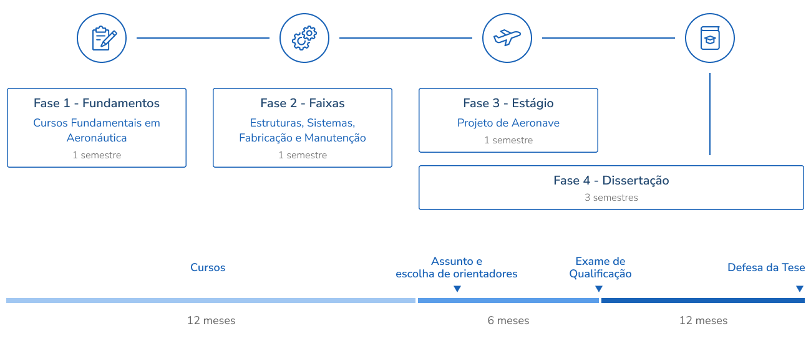

<h1 id="inicio" align="center">

  

    
    
  

   
  Programa de Especialização em Engenharia
</h1>

Parceria da Embraer com o ITA para engenheiro(a)s das mais diversas modalidades que queiram atuar com desenvolvimento integrado de produto, tecnologia e inovação. O Curso de Mestrado Profissional em Engenharia Aeronáutica do ITA foi criado para atender demanda de recursos humanos da Empresa Brasileira de Aeronáutica (EMBRAER), com o oferecimento de um conteúdo curricular dedicado às necessidades tecnológicas da empresa.

## 🌒 Fases do Programa de Especialização

<table>
  <tbody>
    <tr>
      <td align="center">Fase 1 
        
        &nbsp;&nbsp;&nbsp;&nbsp;&nbsp;
        Fundamentos da aeronáutica
        
      </td>
      <td align="center">Fase 2 
        &nbsp;&nbsp;&nbsp;&nbsp;&nbsp;Especialização em Sistemas
      </td>
      <td align="center">Fase 3 
        &nbsp;&nbsp;&nbsp;&nbsp;&nbsp;Projeto de aeronave
      </td>
      <td align="center">Fase 4 
        &nbsp;&nbsp;&nbsp;&nbsp;&nbsp;Dissertação de mestrado
      </td>
    </tr>
    <tr>
        <td></td>
        <td></td>
        <td></td>
        <td></td>
    </tr>
  </tbody>
</table>

## 🗓️ Visão geral do programa

<!-- ### n. [Tecnologia n](#)

- [Subtópico 1](#link-para-subtopico-1)
- [Subtópico 2](#link-para-subtopico-2)
- [Subtópico 3](#link-para-subtopico-3) -->

## 🤝 Pessoas colaboradoras

Agradecemos às seguintes pessoas que contribuíram para este projeto:

<table>
  <tr>
    <td align="center">
      <a href="https://github.com/taffarel55">
         
        
          <b>Maurício Taffarel</b>
        
      </a>
    </td>
    <!--
    <td align="center">
      <a href="#">
         
        
          <b>Mark Zuckerberg</b>
        
      </a>
    </td>
    <td align="center">
      <a href="#">
         
        
          <b>Steve Jobs</b>
        
      </a>
    </td>
    -->
  </tr>
</table>

## 📝 Disclaimer

Esse projeto tem o objetivo de listar itens realizados na minha pós graduação, todo o conteúdo exibido aqui está (esteve) disponível publicamente no site do ITA: https://web.archive.org/web/20240718214156/https://mpaer.ita.br/

[⬆ Voltar ao topo](#inicio) 
